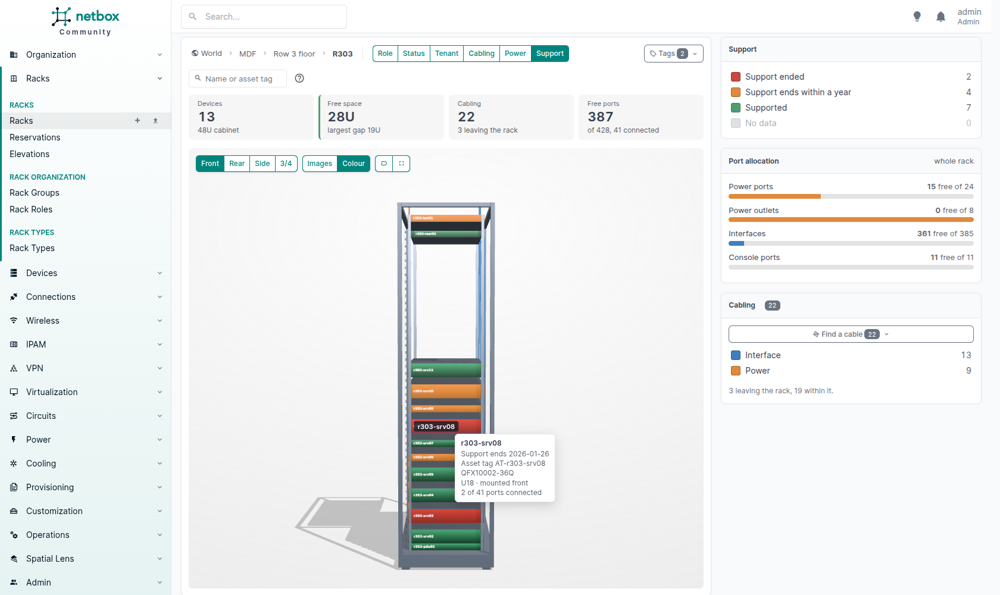
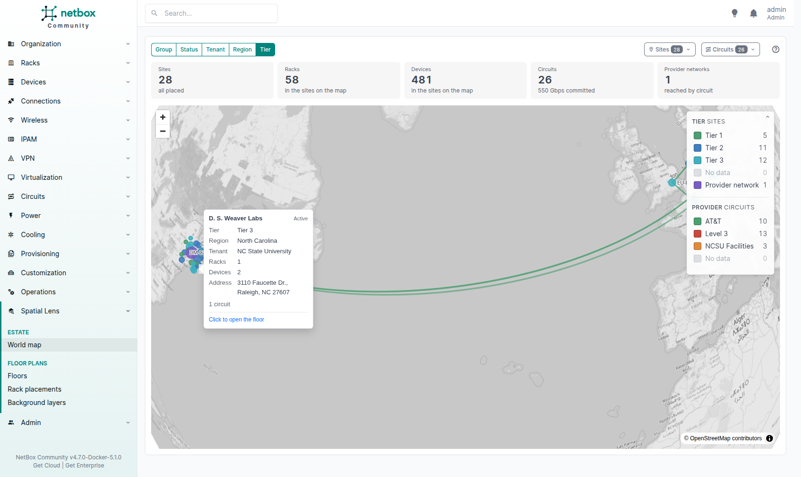
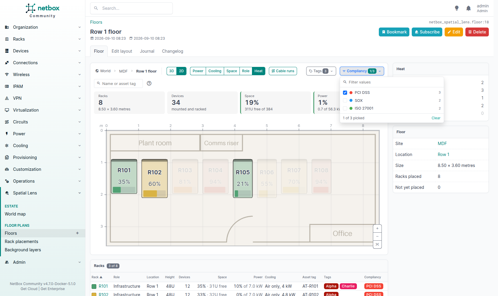

# Extending

Three ways to build on the plugin.

| Extension | How | Where it applies |
|---|---|---|
| [Colour by](#colour-by) | Code: register a function from your plugin's `ready()` | Floor, rack view, world map |
| [Filter by](#filter-by) | Configuration: name custom fields in `filter_custom_fields` | Floor, rack view |
| [Read a floor through the REST API](#read-a-floor-through-the-rest-api) | HTTP: two read-only endpoints | A floor |

Colourings and filters act on the same drawing. [How they combine](#how-colourings-and-filters-combine) says what the reader sees when both are in use.

## Colour by

Each level has a registry of colourings. The buttons above each drawing list what is registered.

| Level | Register with | The function gets | URL parameter |
|---|---|---|---|
| Floor | `netbox_spatial_lens.overlays.register_overlay` | The racks on one floor, as `Rack` objects with role, location, tenant and tags loaded | `?overlay=` |
| Rack view | `netbox_spatial_lens.device_overlays.register_device_overlay` | The mounted devices. Each has `.device` (with role, device type, tenant and tags loaded), `.port_count`, `.connected_count` and `.power` (`allocated_watts` and `maximum_watts`, or `None`). | `?colour=` |
| World map | `netbox_spatial_lens.site_overlays.register_site_overlay` | The sites on the map, as `Site` objects with region, group and tenant loaded | `?overlay=` |

All three take the same arguments: `register_…(name, label, fn, description='', legend=None)`.

- `name` goes in the URL, so keep it stable.
- `label` is the button text, and `description` its tooltip.
- `fn` gets the whole set at once, not one item at a time. Read what you need in one query for the set, not one query per item. Custom field data is already on each item, so reading it costs no query.

### What the function returns

A dictionary from each item's primary key to a `netbox_spatial_lens.overlays.RackValue(colour, label, value)`. On the rack view, the key is the device's primary key (`mounted.device.pk`).

- `colour`: a hex colour such as `'#4c9f70'`. `netbox_spatial_lens.palette` holds the plugin's own colours; use them, so your colouring reads like the built-in ones.
- `label`: the reading. It is shown in the item's hover card on every level, and is the legend entry when the legend is built from the data. On the world map, the card names it after the colouring's label, and leaves it out where the card already says it, such as the group when colouring by group.
- `value`: `None` means "no data": the item is drawn grey and counted under **No data**. On the floor, a number from 0 to 100 draws a gauge on the rack and prints the percentage. Anything else is only a marker that the item has data.

An item missing from the dictionary counts as no data. If the function raises, the error is logged and every item is drawn grey; the page still opens.

### The legend

- **Fixed bands:** pass `legend=[LegendEntry(colour, label), …]` (`netbox_spatial_lens.overlays.LegendEntry`). Every colour your function returns must be one of these colours, and each colour must be used by one entry only: the legend counts and filters by colour. Use fixed bands when the bands exist whatever the data is, such as "how full". `netbox_spatial_lens.palette.utilisation_colour(percent)` and `netbox_spatial_lens.overlays.UTILISATION_LEGEND` give the plugin's own four bands.
- **Bands from the data:** pass no legend. The legend then has one entry per distinct `label`, in name order, and filters by label, so two labels may share a colour. Use it when the values are names, such as tenants. `netbox_spatial_lens.palette.distinct_colours(names)` gives each name a colour that is stable across restarts and not used by another name.

The **No data** entry is always added last.

### Which colouring a page opens with

The one named in the URL. If no colouring has that name, the default from the settings (`default_overlay`, `default_device_overlay` or `default_site_overlay`). If no colouring has that name either, the first one registered. A link to a colouring that no longer exists still opens the page.

### Permissions

Every page draws only the items the reader may view, so the items your function gets are safe to read. The function does not get the reader. If it reads other objects, such as the devices in a rack, a circuit or a monitoring system, do not put in a label what some readers may not see.

### Example: heat load on the floor

This colours each rack by a heat load recorded in a rack custom field, `heat_load_kw`, against the rack's own cooling capacity. A rack with either value missing is no data. The bands are fixed.

```python
# yourplugin/lens.py
from netbox_spatial_lens.overlays import RackValue
from netbox_spatial_lens.palette import utilisation_colour


def heat_overlay(racks):
    values = {}
    for rack in racks:
        load = rack.custom_field_data.get('heat_load_kw')
        if load is None or not rack.cooling_capacity:
            continue  # no data: grey, and counted under "No data"
        percent = float(load) / float(rack.cooling_capacity) * 100
        values[rack.pk] = RackValue(
            colour=utilisation_colour(percent),
            label=f'{load:g} of {rack.cooling_capacity:g} kW',
            value=percent,  # a number, so the floor draws a gauge
        )
    return values
```

The result: a **Heat** button beside the built-in colourings, each rack gauged against its own cooling capacity, and the plugin's four bands in the legend.


### Example: end of support in the rack view

This colours each device by a date custom field, `support_end`. The bands are fixed, in the palette's status colours.

```python
# yourplugin/support.py
from datetime import date

from netbox_spatial_lens.overlays import LegendEntry, RackValue
from netbox_spatial_lens.palette import STATUS_COLOURS

ENDED = LegendEntry(STATUS_COLOURS['red'], 'Support ended')
ENDING = LegendEntry(STATUS_COLOURS['orange'], 'Support ends within a year')
SUPPORTED = LegendEntry(STATUS_COLOURS['green'], 'Supported')
SUPPORT_LEGEND = [ENDED, ENDING, SUPPORTED]


def support_overlay(mounted):
    today = date.today()
    values = {}
    for m in mounted:
        end = m.device.custom_field_data.get('support_end')
        if not end:
            continue  # no data
        days = (date.fromisoformat(end) - today).days
        band = ENDED if days < 0 else ENDING if days < 365 else SUPPORTED
        values[m.device.pk] = RackValue(colour=band.colour, label=f'Support ends {end}', value=end)
    return values
```

The result: a **Support** button beside the built-in colourings, each device in its band, and the date in its hover card.



### Example: service tier on the world map

This colours each site by a select custom field, `service_tier`. The values are names, so the legend is built from the data.

```python
# yourplugin/tiers.py
from netbox_spatial_lens.overlays import RackValue
from netbox_spatial_lens.palette import distinct_colours


def tier_overlay(sites):
    tiers = {site.pk: site.custom_field_data.get('service_tier') for site in sites}
    colours = distinct_colours(tier for tier in tiers.values() if tier)
    return {pk: RackValue(colour=colours[tier], label=tier, value=tier) for pk, tier in tiers.items() if tier}
```

The result: a **Tier** button on the map, one legend entry per tier in use, and the tier in each site's hover card.



### Registering

Register from your plugin's `ready()`:

```python
# yourplugin/__init__.py
from netbox.plugins import PluginConfig


class YourPluginConfig(PluginConfig):
    name = 'yourplugin'
    # ...

    def ready(self):
        super().ready()
        from netbox_spatial_lens.device_overlays import register_device_overlay
        from netbox_spatial_lens.overlays import UTILISATION_LEGEND, register_overlay
        from netbox_spatial_lens.site_overlays import register_site_overlay

        from .lens import heat_overlay
        from .support import SUPPORT_LEGEND, support_overlay
        from .tiers import tier_overlay

        register_overlay(
            'heat',
            'Heat',
            heat_overlay,
            description='Heat load against cooling capacity.',
            legend=UTILISATION_LEGEND,
        )
        register_device_overlay(
            'support',
            'Support',
            support_overlay,
            description='When vendor support ends.',
            legend=SUPPORT_LEGEND,
        )
        register_site_overlay('tier', 'Tier', tier_overlay, description='The service tier of each site.')


config = YourPluginConfig
```

List your plugin after `netbox_spatial_lens` in `PLUGINS`. A name registered twice keeps the later registration, so this order also lets you replace a built-in colouring by registering its name. To remove a built-in colouring instead, leave it out of `enable_builtin_overlays`, `enable_builtin_device_overlays` or `enable_builtin_site_overlays` (see [Configuration](configuration.md)).

## Filter by

A select or multiselect custom field can narrow the floor and the rack view the way tags do. Name the fields in the `filter_custom_fields` setting; no code is needed.

```python
PLUGINS_CONFIG = {
    'netbox_spatial_lens': {
        'filter_custom_fields': ['compliancy', 'support_contract'],
    },
}
```

| Level | A field assigned to | Gets |
|---|---|---|
| Floor, in 3D and in 2D | Racks | A button beside **Tags**, a column in the rack table, and a line in the rack's hover card |
| Rack view | Devices | A button beside **Tags** |

The world map has no custom field filters.



- The button lists the values in use on the page, with how many racks or devices carry each, in the order of the field's choices. A field with no value in use gets no button.
- Each value wears the colour of its choice in the choice set. A choice with no colour gets one that no other value on the page wears.
- Tick values to narrow the drawing to the racks or devices with any of them.
- The buttons come in the order the setting names the fields.
- A field that is not select or multiselect, not assigned to racks or devices, or hidden in the UI, is skipped. A name that matches no field is skipped too, so a typo does not stop NetBox from starting.

## How colourings and filters combine

A drawing has one colouring and several ways to narrow it: the legend, the **Tags** finder, a finder per custom field, and the find box. On the world map, the **Sites** and **Circuits** finders and the provider legend narrow it too.

- In one legend or one finder, picks add up: tick two values and the items with either one stay lit.
- Across them, picks narrow each other: an item stays lit only if it is kept by every legend, every finder and the find box.
- Nothing picked in a legend or a finder keeps every item.
- The picks are kept in the URL hash and the colouring in the query string, so a reload or a copied link opens the drawing narrowed the same way.
- Escape clears every pick.

So a legend band from your colouring and a custom field value work together: "the PCI DSS racks over 90% of their cooling capacity" is one band and one tick.

## Trying the examples

The dev stack registers every example on this page, read from this page, so what you see is what the page says. See [Development](development.md#the-extending-examples).

## Read a floor through the REST API

`GET /api/plugins/spatial-lens/floors/<id>/layout/` returns everything one drawing of the floor needs, for a renderer of your own. It applies the same permissions as the floor page: racks and devices the caller may not view are left out.

| Query parameter | Effect |
|---|---|
| `overlay=<name>` | The colouring to evaluate, chosen as the floor page chooses it (see [Which colouring a page opens with](#which-colouring-a-page-opens-with)). |
| `runs=1` | Also return the cable runs between racks and the cables that leave the floor. |

Positions and sizes are in centimetres from the room's top-left corner. A rack's `x` and `y` are its centre.

| Key | Holds |
|---|---|
| `floor` | `id`, `name`, `width_cm`, `depth_cm` |
| `overlay` | `name`, `label`, and `legend` as a list of `colour` and `label`; `null` when no colouring is registered |
| `racks` | For each rack: `rack_id`, `name`, `x`, `y`, `rotation` (degrees clockwise), `width`, `depth`, `u_height`, `estimated_footprint`, `colour`, `label`, `fraction` (0 to 1, or `null` when the colouring measures no quantity) and `facts` (label and value pairs) |
| `layers` | The enabled background images: `id`, `name`, `source` (the image URL), `x`, `y`, `width`, `height`, `rotation`, `opacity` |
| `runs` | With `runs=1`: `rack_a`, `rack_b` and the `count` of cables between them |
| `exits` | With `runs=1`: `rack`, the `label` and `kind` of what the cables reach, their `count`, and the `x` and `y` of the point on the wall |

`GET /api/plugins/spatial-lens/floors/<id>/devices/` returns the devices in every rack on the floor, as the floor's Devices view draws them, with the same permissions. It has one entry in `racks` per placed rack:

| Key | Holds |
|---|---|
| `id` | The rack's id, as `rack_id` in the layout |
| `cabinet` | The cabinet in millimetres, centred on its footprint with its front towards +z: `width`, `depth`, `height`, `plinth`, `interior`, `faceplate`, `frontRailZ`, `rearRailZ` |
| `devices` | For each mounted device: `id`, `label`, `url`, `assetTag`, `box` (centre x, y, z and width, height, depth, in the cabinet's millimetres), `facing` (`front` or `rear`), `images` (`front` and `rear` URLs, empty when the device type has none), `colour` and `facts` |

The three models also have the usual NetBox endpoints: `floors`, `rack-placements` and `floor-layers` under `/api/plugins/spatial-lens/`.
